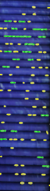

# Rice Grain Counting using OpenCV

This project is an **exploratory computer vision application** where I leveraged **OpenCV** to detect and count rice grains from images with high accuracy. The challenge was not just in detecting individual grains but also in handling **complex real-world cases** such as **overlapping or joined grains** that often lead to miscounts.  

Through **iterative experimentation** and **refined image preprocessing techniques**, I was able to build a pipeline that significantly improves grain detection accuracy.

---

## 🔍 Project Overview

- Implemented a **computer vision pipeline** using **OpenCV** in a Jupyter Notebook.  
- Tackled the problem of **accurately counting rice grains** in images, which involved challenges like:
  - Handling **joined/overlapping grains**.  
  - Eliminating background noise and unwanted reflections.  
- Designed and tested multiple approaches before refining the method for **robust detection and counting**.  

This project demonstrates skills in **image preprocessing, contour analysis, morphological operations, and object segmentation**.

---

## 🔬 Approach

The workflow followed for this project:

1. **Preprocessing & Background Removal**
   - Resized the input image for efficiency.
   - Converted to **HSV color space** and applied a mask to remove the blue background, isolating only the rice grains.

2. **Image Enhancement**
   - Converted to grayscale.
   - Applied **Gaussian Blur** to smooth noise.
   - Used **Otsu’s Thresholding** to separate grains from the background.

3. **Contour Detection & Classification**
   - Extracted contours representing grains.
   - Classified them into:
     - **Isolated grains** (small, well-defined contours).
     - **Touching grains** (larger contours that likely represent multiple grains).

4. **Grain Estimation**
   - Calculated the **average area** of isolated grains.
   - Estimated the number of grains in touching clusters by dividing contour area by average isolated grain area.

5. **Visualization**
   - **Yellow contours** = isolated grains.
   - **Green contours** = touching grain clusters.

This pipeline ensures robust grain counting, even when grains overlap or stick together.

---

## Sample workflow examples

Below are the key steps and outputs from the rice grain counting process:

### 1. Original Image

### 2. Processed / Thresholded Image

### 3. Final Output with Count

---
## 📊 Results

| Category                  | Count |
|---------------------------|-------|
| Isolated Grains           | **59** |
| Touching Grains (Estimated) | **51** |
| **Total Grains**          | **110** |

## 🛠️ Tools & Technologies

- **Python**
- **Jupyter Notebook**
- **OpenCV** (for computer vision & image processing)
- **NumPy** (for efficient computation)
- **Matplotlib** (for visualization of intermediate steps)

---

## 🚀 Key Highlights

- Demonstrated **end-to-end problem-solving skills** in a real-world image processing task.  
- Built **robust methods** to separate and count **seemingly joined grains**.  
- Showcased **exploratory data science mindset**: experimenting, failing, and refining until achieving optimal results.  
- Learned to balance **accuracy vs computational efficiency** in CV pipelines.  
- Project can be extended for **quality control in agriculture/food processing industries**.  

---

